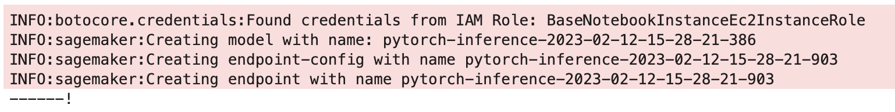
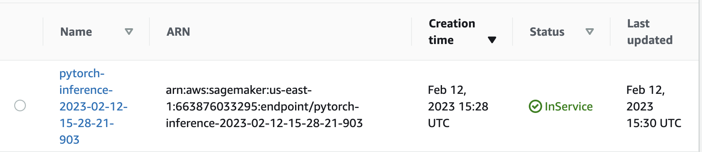
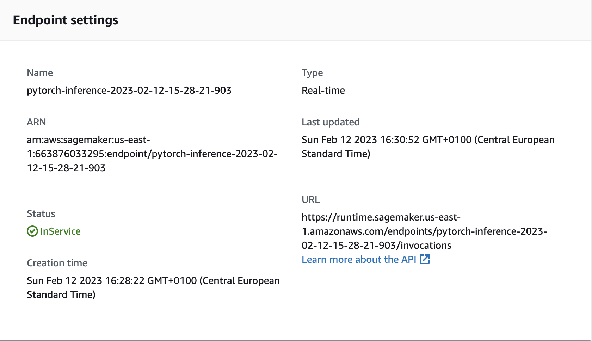
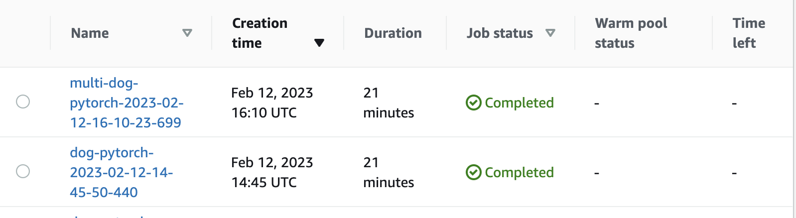
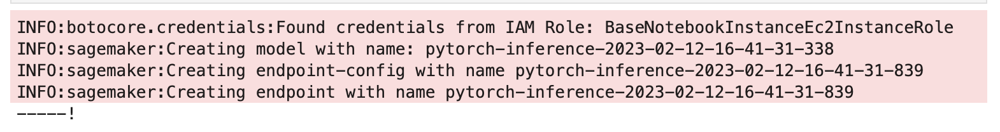
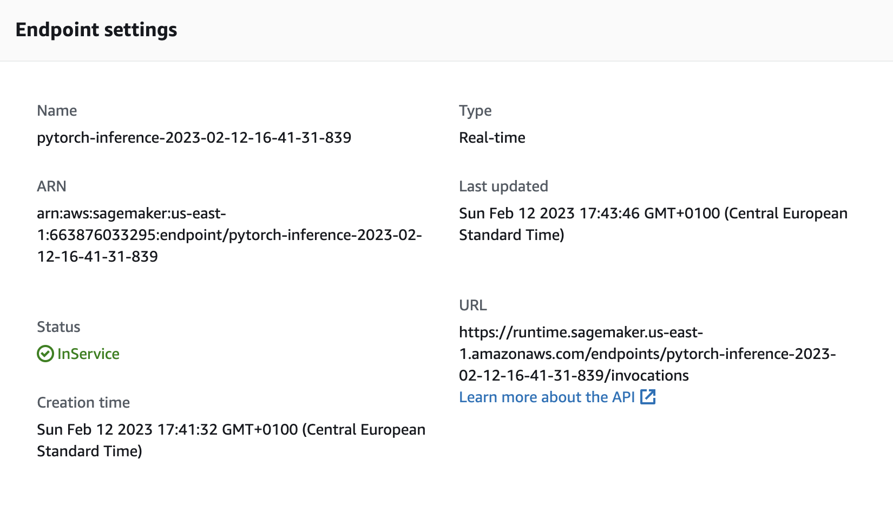
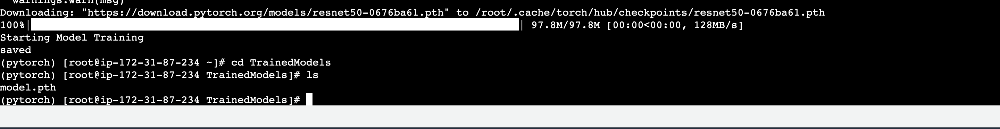
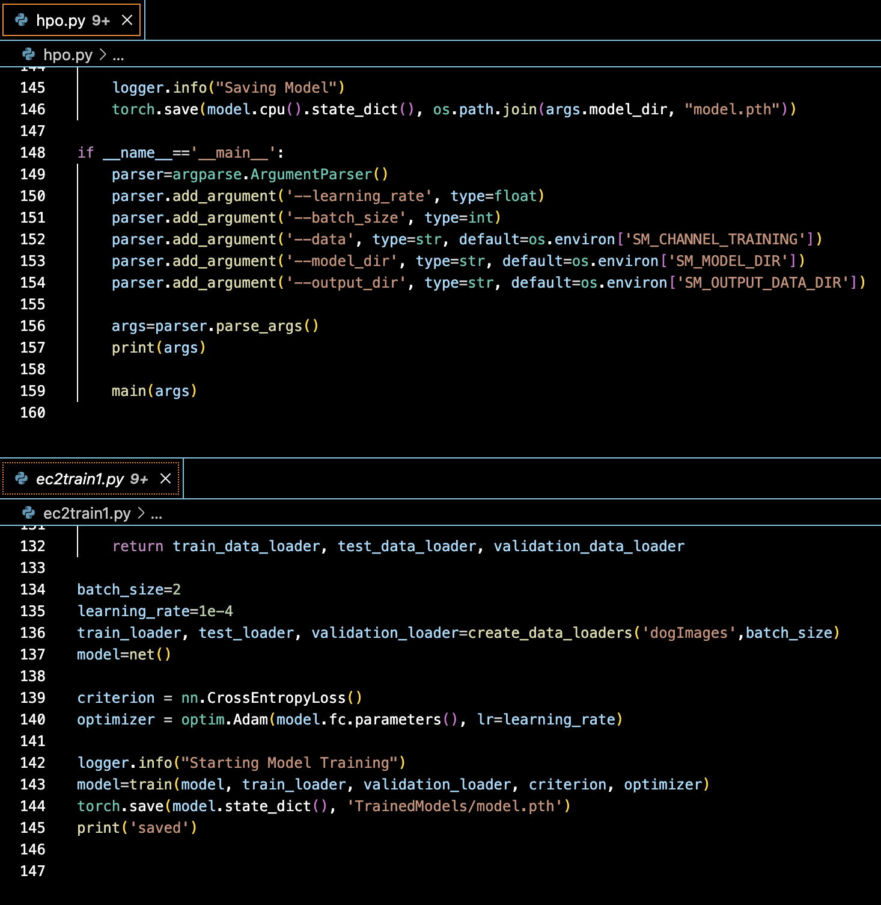

# Operationalizing an AWS Machine Learning Project

## Initial Set Up


The ml.t3.medium is the cheapest among Sagemaker's standard instances at $0.05 per hour. It has 5 GiB of memory and runs on 2 vCPU. Optimized to start within 2 minutes, this instance would mean less waiting time in between starting and stopping the instance. This is important as one way of sticking to a limited budget is to work remotely and locally simultaneouly, requiring starting and ending the instance repetitively.

Although there are other instance types with the same fast launch feature, like the more powerful ml.g4dn.xlarge, which allows GPU-based capabilities, it is best to start conservatively with a smaller instance before moving on to a bigger instance should a faster performance be required for the workload, considering that this is a small, personal project.

## Initial Training & Deployment

```Python
hyperparameters = {'batch_size': 64, 'learning_rate': '0.037260043722494224'}
estimator = PyTorch(
    entry_point='hpo.py',
    base_job_name='dog-pytorch',
    role=role,
    instance_count=1,
    instance_type='ml.m5.xlarge',
    framework_version='1.4.0',
    py_version='py3',
    hyperparameters=hyperparameters,
    ## Debugger and Profiler parameters
    rules = rules,
    debugger_hook_config=hook_config,
    profiler_config=profiler_config,
)
```





## Multiple Instance Training & Deployment

The time it took for the model to be trained was no different from that of the singular instance, however, the model with 3 instances did a better job at classifying the image, considering that the actual image has a label of 11.

```Python
mi_estimator = PyTorch(
    entry_point='hpo.py',
    base_job_name='multi-dog-pytorch',
    role=role,
    instance_count=3,
    instance_type='ml.m5.xlarge',
    framework_version='1.4.0',
    py_version='py3',
    hyperparameters=hyperparameters,
    ## Debugger and Profiler parameters
    rules = rules,
    debugger_hook_config=hook_config,
    profiler_config=profiler_config,
)
```





```Python
pred[0]
# single instance => 28
# multiple instance => 11
```

## EC2 Training

Unlike the demo shown in the module, there were only 3 choices for Deep Learning AMIs and only 2 of them have an environment that supports Pytorch packages and dependencies.

Unlike the AMI used in the demo, the Pytorch environment cannot be activated using instances other than: G3, P3, P3dn, P4d, G5, G4dn.

[AWS Deep Learning AMI GPU PyTorch 1.12 (Amazon Linux 2)](https://aws.amazon.com/releasenotes/aws-deep-learning-ami-gpu-pytorch-1-12-amazon-linux-2/)

[AWS Deep Learning AMI GPU PyTorch 1.13 (Amazon Linux 2)](https://aws.amazon.com/releasenotes/aws-deep-learning-ami-gpu-pytorch-1-13-amazon-linux-2/)

After going through the prices of these options and keeping in mind the budget given for this module, the best option was a g4dn.xlarge instance which costs $0.3418 for on-demand instances and $0.1578 for spot instances.

Among all the instances that is required by the AMI, this has the lowest cost for both on-demand and spot instances. As the use of spot instances have a limit and requesting for an increase takes time, having the option to use either spot or on-demand instances for a project that has a tight deadline without breaking the budget is of high importance.

[See "Spot vs on-demand pricing"](https://aws.amazon.com/ec2/spot/pricing/)



## EC2 script vs hpo script



The main difference between the hpo.py script and the ec2train1.py script lies in the way the arguments and hyperparameters are introduced to the model. In the ec2train1.py script, the hyperparameters and arguments are declared at the end of the script whereas the arguments and hyperparameters of the hpo.py script are declared within the Sagemaker notebook instance and are introduced to the script using ```parser.argparse.ArgumentParser()``` and a main function.

```Python
if __name__=='__main__':
    parser=argparse.ArgumentParser()
    parser.add_argument('--learning_rate', type=float)
    parser.add_argument('--batch_size', type=int)
    parser.add_argument('--data', type=str, default=os.environ['SM_CHANNEL_TRAINING'])
    parser.add_argument('--model_dir', type=str, default=os.environ['SM_MODEL_DIR'])
    parser.add_argument('--output_dir', type=str, default=os.environ['SM_OUTPUT_DATA_DIR'])
    
    args=parser.parse_args()
    print(args)
    
    main(args)
```


```json
Test Event Name
test_dog

Response
{
  "statusCode": 200,
  "headers": {
    "Content-Type": "text/plain",
    "Access-Control-Allow-Origin": "*"
  },
  "type-result": "<class 'str'>",
  "COntent-Type-In": "<__main__.LambdaContext object at 0x7f3958fc3c40>",
  "body": "[[0.22258417308330536, 0.2867152690887451, 0.23660334944725037, 0.3973812758922577, 0.5946304798126221, 0.32388997077941895, 0.14295358955860138, 0.2593267858028412, -0.2645488977432251, -0.0056010279804468155, 0.3683377206325531, 0.40309959650039673, -0.011438594199717045, 0.3243323266506195, 0.4832281768321991, 0.11940720677375793, 0.3301726281642914, 0.016071753576397896, 0.13358867168426514, 0.4334683120250702, 0.3398759961128235, -0.12303052097558975, 0.38373783230781555, 0.208574116230011, -0.17253750562667847, -0.13229110836982727, 0.41559934616088867, -0.3317200839519501, 0.5983749032020569, 0.15570591390132904, 0.2418746054172516, 0.5634035468101501, -0.06630165129899979, 0.260342001914978, 0.15422964096069336, 0.26249510049819946, 0.05999879539012909, 0.17178316414356232, 0.28845247626304626, 0.14137883484363556, 0.2950528860092163, 0.34624922275543213, 0.1801588386297226, 0.37983566522598267, 0.1358564794063568, 0.39831653237342834, 0.09975286573171616, 0.06437289714813232, 0.20123106241226196, 0.2751830816268921, 0.3577496409416199, 0.10020403563976288, 0.09287401288747787, 0.2717002034187317, 0.10770490020513535, 0.19640129804611206, 0.40510982275009155, 0.02587900683283806, -0.0023690317757427692, 0.05544339120388031, 0.2715991735458374, 0.0018166087102144957, 0.1619286835193634, -0.12189028412103653, 0.04019118845462799, -0.28905490040779114, -0.18545860052108765, 0.35718852281570435, 0.02673361450433731, 0.06363802403211594, 0.3299733102321625, 0.10386842489242554, -0.2123139351606369, -0.02947426214814186, 0.026548288762569427, 0.33504170179367065, -0.09340201318264008, -0.23949125409126282, 0.19283726811408997, -0.06110447272658348, -0.06545177847146988, 0.1155146136879921, 0.05927373468875885, 0.28965985774993896, -0.19908912479877472, 0.05027751624584198, 0.3238394558429718, 0.20499038696289062, 0.015548424795269966, 0.2560834586620331, 0.25757649540901184, 0.024451695382595062, -0.1503819227218628, -0.037278901785612106, 0.10541312396526337, 0.116038016974926, -0.05723908543586731, -0.04249229282140732, -0.11206389963626862, -0.2917730212211609, -0.01494930312037468, -0.32105588912963867, 0.3950178921222687, -0.3360593318939209, -0.322693407535553, 0.0007147123105823994, -0.07922632992267609, -0.4352700412273407, -0.19211743772029877, -0.1981441080570221, -0.08153677731752396, 0.18471316993236542, -0.0832882970571518, -0.27037137746810913, 0.3735558092594147, -0.366347998380661, 0.0038887872360646725, 0.2003762274980545, -0.21762414276599884, -0.048697978258132935, -0.3799019455909729, -0.37747669219970703, -0.14877746999263763, 0.009409474208950996, -0.2609257102012634, -0.37330231070518494, -0.05776982381939888, -0.342445969581604, 0.03831148520112038, 0.062469542026519775, -0.41384974122047424, -0.5424782037734985, -0.3256552815437317]]"
}

Function Logs
START RequestId: b7fdccd8-6ade-4b0f-adae-c110bdf083b8 Version: $LATEST
Context::: <__main__.LambdaContext object at 0x7f3958fc3c40>
EventType:: <class 'dict'>
END RequestId: b7fdccd8-6ade-4b0f-adae-c110bdf083b8
REPORT RequestId: b7fdccd8-6ade-4b0f-adae-c110bdf083b8	Duration: 1343.56 ms	Billed Duration: 1344 ms	Memory Size: 128 MB	Max Memory Used: 75 MB

Request ID
b7fdccd8-6ade-4b0f-adae-c110bdf083b8

```

You should also notice the content of this Lambda function. You may have to set up many Lambda functions in your career, so do your best to understand how this one is set up so you can follow its example. In particular, you should notice how it invokes the endpoint (with the invoke_endpoint() method) and how it sets up the return statement. Write at least 1 paragraph describing how this function is written and how it works.


Write about the security of your AWS workspace in your writeup. Are there any security vulnerabilities that need to be addressed? 