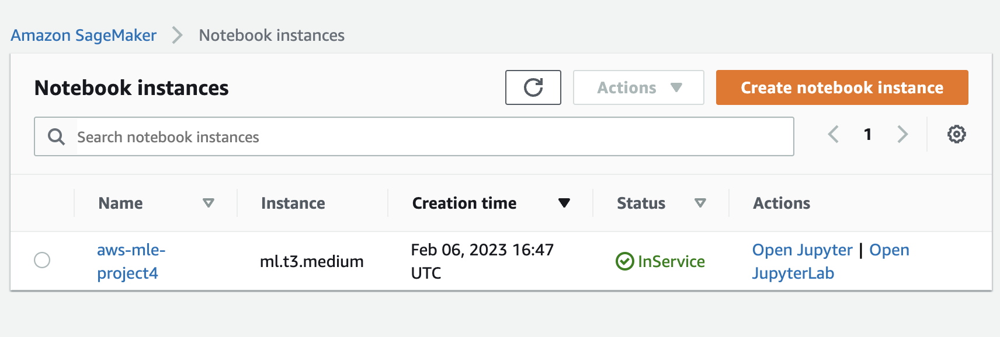

# Operationalizing an AWS Machine Learning Project

## Initial Set Up

The ml.t3.medium is the cheapest among Sagemaker's standard instances at $0.05 per hour. It has 5 GiB of memory and runs on 2 vCPU. Optimized to start within 2 minutes, this instance would mean less waiting time in between starting and stopping the instance. This is important as one way of sticking to a limited budget is to work remotely and locally simultaneouly, requiring starting and ending the instance repetitively.

Although there are other instance types with the same fast launch feature, like the more powerful ml.g4dn.xlarge, which allows GPU-based capabilities, it is best to start conservatively with a smaller instance before moving on to a bigger instance should a faster performance be required for the workload, considering that this is a small, personal project.

